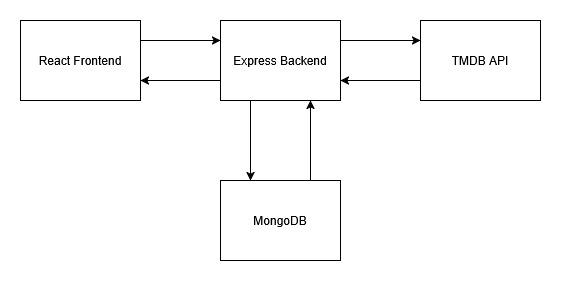

# SuperWatch - Film Web Application
SuperWatch is a full-stack film discovery web application built with React (frontend) and Node.js/Express (backend). 
It integrates the TMDB API for live film data and streaming availability, while persisting user watchlists in MongoDB.

## Features
### App Features
-	Search films by title
-	Detailed film pages including banner, poster/logo, metadata, streaming availability, and top cast
-	Add/remove films from a personal watchlist
-	Dashboard displaying:
    -	Watchlist films currently available for streaming
    -	Popular films
### Authentication & Security
-	User authentication and authorisation
-	Protected backend routes
-	JWT stored in HTTPOnly cookies
-	Server-side token verification
### Performance & UX
-	Infinite scroll using IntersectionObserver
-	Lazy image loading
-	Loading and error states for API requests
-	Responsive design

## Tech Stack

### Frontend
-	React
-	React Router
-	CSS Modules
-	CSS variables and utilities for maintainability
-	IntersectionObserver API
-	Fetch API

### Backend
- Node.js / Express
-	MongoDB / Mongoose
-	TMDB API integration
-	RESTful endpoints
-	Axios
-	CORS
-	Cookie parsing and token handling

## System Design

The system is composed of a React frontend, Node.js/Express backend and a MongoDB database. 
The backend integrates the TMDB API for live film details. 
The backend acts as middleware between the user and the TMDB API, centralising data handling, authentication/authorisation, and TMDB API integration.

### Search and Film Details

Search and Film details are pulled from the TMDB API via the backend and parsed to the user. 

### Watchlist Funtionality

When a user saves a film:
- A shared film copy is stored in the database (if not already present)
- Users reference films in their individual watchlists
- Watchlist data is served directly from the database

### Engineering Decisions
- Stored shared film copies to prevent duplication and reduce TMDB API load.
- Centralised TMDB integration in the backend to protect API keys.

